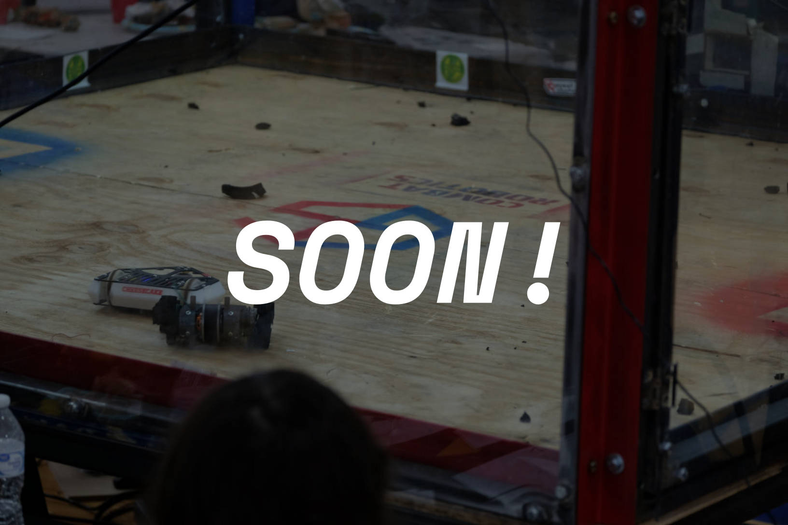

# Agent Guide: Garden State Combat Robotics League Website

> This file exists to help AI coding agents work with the GSCRL site safely, consistently, and without re-discovering the project's conventions every session.

## Project Overview

- **Type:** Static, content-driven marketing/event website (no CMS, no backend).
- **Domain:** `gscrl.org` (see `CNAME` file in repo root).
- **Theme base:** HTML5 UP "Hyperspace" template.
  - License comment blocks must remain in any file that still carries them.
  - Do not remove template reference files (`generic.html`, `elements.html`) unless explicitly asked.
- **Audience:** Combat-robotics competitors, volunteers, sponsors, and spectators in New Jersey.

## Tech Stack

- **Markup:** Plain HTML5.
- **Styling:** SCSS source in `assets/sass/`, compiled to `assets/css/`.
- **Interactivity:** jQuery 3.x plus small HTML5 UP plugins (`scrollex`, `scrolly`, `browser`, `breakpoints`, `util`).
- **Icons:** Font Awesome 5 Free (webfonts and CSS checked into `assets/webfonts/` / `assets/css/`).
- **Images:** Stock/placement photos in `images/`; sponsor logos in `images/sponsors/`; event photos in `images/event_sites/`.
- **Build tooling:** None currently checked in. SCSS is compiled manually.
- **Hosting:** GitHub Pages from the `GSCRL/website` repository, serving the `gscrl.org` apex domain and `www.gscrl.org` via the `CNAME` file.

## Repository Layout

```text
/                      Root HTML pages
├── index.html         Home + event listings + sponsors + contact (long scrolling page)
├── event_info.html    Event registration and rules overview
├── support.html       Volunteering / hosting / donation info
├── start.html         "Get Started" beginner page (mostly stub)
├── rules.html         Redirect to Google Docs rules
├── generic.html       HTML5 UP generic page template (reference)
├── elements.html      HTML5 UP component showcase (reference)
├── CNAME              gscrl.org
├── assets/
│   ├── css/           Compiled CSS (commit after SCSS changes)
│   ├── sass/          SCSS source of truth
│   ├── js/            jQuery + plugins + main.js
│   ├── webfonts/      Font Awesome webfonts
│   └── img/           Site logo / SVG
└── images/
    ├── event_sites/   Event card images
    ├── sponsors/      Sponsor logos
    └── pic*.jpg       Stock/placement photos
```

## Build / Compile Workflow

SCSS source files live in `assets/sass/`, and the entry point is `assets/sass/main.scss`. After any SCSS edit, compile to `assets/css/main.css` (and `assets/css/noscript.css` from `assets/sass/noscript.scss`). Commit both the edited SCSS source *and* the generated CSS.

### Minimal tooling

The goal is as little installed software as possible. You need only:

1. **Dart Sass standalone binary** — a single ~7 MB executable, no Node/npm required.
   - Download from: https://github.com/sass/dart-sass/releases
   - Put it on your `PATH` as `sass` (or reference it by full path).
2. **`just`** — a tiny command runner, available via most package managers.
   - https://github.com/casey/just
3. **Python 3** — for the local preview server (usually pre-installed).

A `justfile` is provided in the repo root. Common tasks:

```bash
just build   # compile SCSS to CSS
just serve   # start local server at http://localhost:8000
just dev     # compile then serve
just --list  # show all available recipes
```

If you do not have `just` installed, you can still run the underlying Sass commands directly:

```bash
sass assets/sass/main.scss assets/css/main.css --style=expanded
sass assets/sass/noscript.scss assets/css/noscript.css --style=expanded
```

**Do not hand-edit the generated files in `assets/css/` directly** — changes will be lost on the next compile.

## Design System

- **Palette** is defined in `assets/sass/libs/_vars.scss`:
  - Background: `#312450`
  - Accent 1 (purple): `#5e42a6`
  - Accent 2 (indigo): `#5052b5`
  - Accent 3 (magenta): `#b74e91`
  - Body text: `rgba(255,255,255,0.55)`
  - Bold/heading text: `#ffffff`
- **Typography:** Arial / Helvetica stack, bold headings, generous `2em` element margin.
- **Grid:** HTML5 UP's custom `html-grid` classes (`row`, `col-*`, `col-6`, `col-12-xsmall`, `gtr-uniform`, etc.).
- **Common utility classes:**
  - `wrapper style1|style2|style3` — section background styles.
  - `wrapper style1 fullscreen fade-up` — hero section.
  - `spotlights` — alternating image/text event cards.
  - `actions` / `actions stacked` / `button fit` — button groups.
  - `image fit` — responsive image wrapper.
- **Sidebar:** Only used on `index.html` for one-page navigation. Other pages use `header#header`.

## Content Editing Patterns

### Adding an Event on the Home Page

Events are listed inside `#events > section.spotlights` in `index.html`. Follow this pattern:

```html
<section>
  <a href="EVENT_REGISTRATION_URL" class="image"></a>
  <div class="content">
    <div class="inner">
      <h2>Event Name</h2>
      <h3>Date or "Non-Qualifying Event"</h3>
      <p>Location (optional)</p>
      <hr>
      <ul class="actions">
        <li><a href="EVENT_URL" class="button fit">Event Info</a></li>
        <li><a href="VOD_URL" class="button fit">VOD</a></li>
      </ul>
      <ul class="actions">
        <li><a href="BRACKET_URL" class="button fit">Brackets [Class]</a></li>
      </ul>
    </div>
  </div>
</section>
```

Notes:
- Use `images/event_sites/coming_soon.jpg` when no custom image exists.
- Upload event photos to `images/event_sites/` and update the `src`.
- Prefer high-resolution landscape images; the theme sets them as `background-image`.
- Hide past events by wrapping them in HTML comments rather than deleting them — this preserves history.

### Adding / Updating a Sponsor

Sponsors live in `#sponsors > .box.alt > .row.gtr-uniform` in `index.html`.

Pattern:

```html
<div class="col-4 sponsors"><span class="image fit"><a href="SPONSOR_URL"></a></span></div>
```

- Place logo files in `images/sponsors/`.
- Always provide a descriptive `alt` attribute.
- Keep the 3-column grid by using `col-4`.

### Adding a New Top-Level Page

1. Copy `generic.html` as a starting scaffold.
2. Update `<title>` and `header > a.title`.
3. Add navigation links in relevant pages (`index.html` sidebar and other page headers).
4. Use `#main > section.wrapper > .inner` as the main content container.
5. Include the full script block at the bottom of the body.

## Safe-Edit Rules

- **Do not edit generated `assets/css/*.css` directly** unless fixing an urgent typo while no Sass compiler is available. If you do, document it and plan to backport to SCSS.
- **Keep existing license comments** in template-derived files.
- **Do not delete `generic.html` or `elements.html`** without user approval; they act as living style references.
- **Do not change `CNAME`** unless the domain is actually migrating.
- **Preserve page `<script>` load order** in HTML files: jQuery → plugins → `util.js` → `main.js`.
- **Do not add inline `<style>` blocks** in new HTML. Put styles in `assets/sass/` partials. Existing inline styles in `index.html` are tech debt and should be refactored when touched.

## Accessibility & Quality Checklist

Apply these when editing any page:

- Provide meaningful `alt` text on images; use empty `alt=""` only for decorative images.
- Use semantic heading order (`h1` → `h2` → `h3`) per page.
- Ensure link text is descriptive (avoid "click here").
- Prefer `https://` for all outbound links.
- Ensure sufficient color contrast against the dark purple background.
- Add `<label>` for every form control (or existing `aria-label` / `aria-labelledby`).
- Avoid using `mailto:` forms for critical workflows; document alternatives when asked.

## Known Technical Debt

- `index.html` has an inline `<style>` block and mixed indentation.
- `event_info.html` still contains HTML5 UP template placeholder content under "Lists", "Table", "Buttons", "Form", and "Image" sections.
- `support.html` and `start.html` have commented-out footer HTML.
- `rules.html` is a JavaScript redirect to a Google Docs document; this is intentional but fragile.
- Some outbound links use `http://` (e.g., sponsor `fubarlabs.org` link).
- No meta description, Open Graph tags, or JSON-LD structured data for events.
- No `robots.txt` or `sitemap.xml`.

## Contributor Workflow (Branch → Local Preview → Pull Request → Review → Merge)

This project uses a lightweight branch-and-PR workflow. There is no CI preview build, so all previews happen locally before and during review.

### 1. Start from `main`

```bash
git clone git@github.com:GSCRL/website.git
cd website
git checkout main
git pull origin main
```

### 2. Create a feature branch

Use a descriptive branch name:

```bash
git checkout -b feature/update-sponsors-2025-2026
# or: update/event-dates, fix/broken-links, content/new-season-page
```

### 3. Edit and compile

- Make changes in the HTML, SCSS, images, etc.
- If you touched SCSS, recompile the CSS with `just`:

  ```bash
  just build
  ```

  If you do not have `just`, run the underlying Sass commands directly:

  ```bash
  sass assets/sass/main.scss assets/css/main.css --style=expanded
  sass assets/sass/noscript.scss assets/css/noscript.css --style=expanded
  ```

- **Do not hand-edit the generated files in `assets/css/`.** Commit both the SCSS source and the compiled CSS together.

### 4. Preview locally

From the repository root, start a local server:

```bash
just serve   # starts http://localhost:8000
```

If you do not have `just`, use Python directly:

```bash
python3 -m http.server 8000
```

Then open `http://localhost:8000` and review every changed page at desktop and mobile widths.

### 5. Commit as you go

```bash
git add -A
git commit -m "Update sponsor grid for 2025-2026 season"
```

Keep commits focused and descriptive. If a change spans content and compiled CSS, include both in the same commit so the SCSS and generated CSS never drift apart.

### 6. Push and open a Pull Request

```bash
git push -u origin feature/update-sponsors-2025-2026
```

On GitHub, open a Pull Request against `main`. Include:

- A short summary of what changed and why.
- Screenshots or a checklist of pages you previewed locally.
- A note confirming that you recompiled CSS if SCSS was edited (`just build` or raw `sass`).

### 7. Reviewer checks out the PR locally

The reviewer pulls the PR branch and previews it on their own machine before merging:

```bash
git fetch origin pull/<PR_NUMBER>/head:pr-<PR_NUMBER>
git checkout pr-<PR_NUMBER>
just serve
# review at http://localhost:8000
```

If changes are needed, the reviewer leaves feedback on GitHub. The contributor pushes additional commits to the same branch, and the reviewer re-fetches or runs `git pull` on the local PR branch.

### 8. Merge and deploy

Once approved, the reviewer merges the PR on GitHub. GitHub Pages automatically redeploys `main` to `gscrl.org` and `www.gscrl.org`.

After merging, the reviewer should delete the PR branch (GitHub offers a button) and the contributor should clean up locally:

```bash
git checkout main
git pull origin main
git branch -d feature/update-sponsors-2025-2026
```

### Branch naming conventions

| Prefix | Use for |
|--------|---------|
| `feature/` | New sections, pages, or capabilities |
| `update/` | Content refreshes on existing pages |
| `fix/` | Bug fixes, broken links, styling corrections |
| `content/` | Pure content additions (events, sponsors, blog posts) |

### Things to check before opening a PR

- [ ] SCSS recompiled and CSS committed if styles changed.
- [ ] All changed pages previewed locally.
- [ ] No new inline `<style>` blocks added.
- [ ] Images have meaningful `alt` text.
- [ ] Outbound links use `https://` where possible.
- [ ] No leftover placeholder or commented-out template content.

## Deployment Notes

- This site is served as static files. Any change visible in the repository root is deployable.
- GitHub Pages deploys the `main` branch automatically after a PR is merged.
- There is no PR preview deployment; reviewers must preview PR branches locally as described above.
- If the project later moves to a host such as Cloudflare Pages, the build command should be:

  ```bash
  sass assets/sass/main.scss assets/css/main.css --style=expanded && \
  sass assets/sass/noscript.scss assets/css/noscript.css --style=expanded
  ```

  with output directory set to the repository root.

## Skill Domains Useful for This Project

Agents working here should have access to:

1. **Static site / HTML semantics** — editing plain HTML without a framework.
2. **SCSS / Sass** — maintaining the source styles and compiling to CSS.
3. **GitHub Pages / static hosting** — `CNAME`, root-level deployment, no build step.
4. **jQuery / legacy JS** — small fixes in the existing plugin-based scripts.
5. **Web performance (Core Web Vitals)** — image optimization, render-blocking CSS/JS, font loading.
6. **Web accessibility (a11y)** — alt text, form labels, keyboard navigation, color contrast.
7. **SEO / structured data** — meta tags, Open Graph, Event Schema.org markup.
8. **Responsive design / HTML5 UP conventions** — the custom grid and breakpoint system.
9. **Cloudflare platform** (if migrating or adding dynamic features) — Pages hosting, Turnstile for the contact form, Email Routing for `njcombatrobots@gmail.com`.

## Contact / Data Conventions

- Primary contact email shown on site: `njcombatrobots@gmail.com`.
- Fiscal sponsor / donation route: FUBAR Labs PayPal hosted button (`hosted_button_id=9MH4DD9RCYEFC`).
- Rule document is an external Google Doc; update `rules.html` redirect only if the canonical doc URL changes.
